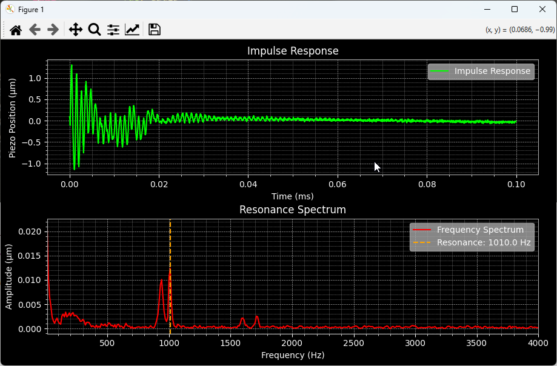

Resonance Measurement
=======================

The :ref:`analysis` module provides tools for performing resonance measurements using the NV200 device. 
It includes the :class:`ResonanceAnalyzer <nv200.analysis.ResonanceAnalyzer>` class, which simplifies 
the process of measuring and analyzing the device's impulse response.

The following example demonstrates how to use the :mod:`nv200.analysis` module with the `NV200Device`.
It covers connecting to the device, measuring the impulse response, computing the resonance spectrum, 
and visualizing the results using matplotlib.

.. code-block:: python

    from nv200.nv200_device import NV200Device 
    from nv200.shared_types import TransportType
    from nv200.analysis import ResonanceAnalyzer
    from nv200.connection_utils import connect_to_single_device

    import matplotlib_helpers

    async def resonance_measurement_test():
        # Connect to the one and only NV200 device connected via serial port
        dev = await connect_to_single_device(NV200Device, TransportType.SERIAL)

        # Create resonance analyzer for the connected device
        analyzer = ResonanceAnalyzer(dev)

        # first measure impulse response and then use it to compute the resonance spectrum
        signal, sample_freq, rec_src = await analyzer.measure_impulse_response()
        xf, yf, res_freq = ResonanceAnalyzer.compute_resonance_spectrum(signal, sample_freq)

        # Get the position unit from the device for showing the unit in the plot
        unit = await dev.get_position_unit()

        # Use matplotlib to plot the recorded data
        t = np.arange(len(signal)) / sample_freq  # time in seconds
        
        # Create figure with 2 subplots (rows=2, cols=1)
        plt.style.use('dark_background')
        fig, (ax1, ax2) = plt.subplots(2, 1, figsize=(10, 6), sharex=False)

        # Plot impulse response into first subplot
        ax1.plot(t, signal, color=(0.0, 1.0, 0.0), label='Impulse Response')
        ax1.set_xlabel("Time (ms)")
        ax1.set_ylabel(f"Piezo Position ({unit})")
        ax1.set_title("Impulse Response")
        matplotlib_helpers.prepare_axes_style(ax1)

        # Plot frequency spectrum into second subplot
        ax2.plot(xf, yf, color='r', label='Frequency Spectrum')
        ax2.axvline(float(res_freq), color='orange', linestyle='--', label=f'Resonance: {float(res_freq):.1f} Hz')
        ax2.set_xlabel("Frequency (Hz)")
        ax2.set_ylabel(f"Amplitude ({unit})")
        ax2.set_title("Resonance Spectrum")
        ax2.set_xlim(10, 4000)
        matplotlib_helpers.prepare_axes_style(ax2)
    
        plt.tight_layout()
        plt.show(block=True)

Step by Step Guide to Performing a Resonance Measurement
--------------------------------------------------------

This guide will walk you through the steps to connect to an NV200 device, measure its impulse response, 
compute the resonance spectrum, and visualize the results.

Step 1: Import Necessary Modules
^^^^^^^^^^^^^^^^^^^^^^^^^^^^^^^^^^^^^^^^^^^^^^^^^^^^^^^^^^^^^^^^

Start by importing all required modules. This includes the NV200 device classes, analysis tools, 
connection utilities, and any plotting helpers.

.. code-block:: python

   import asyncio
   import numpy as np
   import matplotlib.pyplot as plt

   from nv200.nv200_device import NV200Device
   from nv200.shared_types import TransportType
   from nv200.analysis import ResonanceAnalyzer
   from nv200.connection_utils import connect_to_single_device
   import matplotlib_helpers

Step 2: Connect to the NV200 Device
^^^^^^^^^^^^^^^^^^^^^^^^^^^^^^^^^^^^^^^^^^^^^^^^^^^^^^^^^^^^^^^^

Establish a connection to a single NV200 device. In this example, we use a serial transport.

.. code-block:: python

   dev = await connect_to_single_device(NV200Device, TransportType.SERIAL)
   print(f"Connected to device: {dev.name}")

Step 3: Create the Resonance Analyzer
^^^^^^^^^^^^^^^^^^^^^^^^^^^^^^^^^^^^^^^^^^^^^^^^^^^^^^^^^^^^^^^^

Create an instance of `ResonanceAnalyzer` using the connected device. 
This will handle measurement of the impulse response and computation of the resonance spectrum.

.. code-block:: python

   analyzer = ResonanceAnalyzer(dev)

Step 4: Measure Impulse Response
^^^^^^^^^^^^^^^^^^^^^^^^^^^^^^^^^^^^^^^^^^^^^^^^^^^^^^^^^^^^^^^^

Measure the device’s impulse response using the analyzer. This function returns the signal, 
sampling frequency, and the recording source.

.. code-block:: python

   signal, sample_freq, rec_src = await analyzer.measure_impulse_response()

.. admonition:: Attention
   :class: caution

   The impulse response measurement will create a short impulse from a :guilabel:`Base Voltage` to a :guilabel:`Peak Voltage` to
   get the impulse response from the device. Ensure that the resulting motion or force cannot damage your application or surrounding 
   equipment. 

Step 5: Compute the Resonance Spectrum
^^^^^^^^^^^^^^^^^^^^^^^^^^^^^^^^^^^^^^^^^^^^^^^^^^^^^^^^^^^^^^^^

Compute the resonance spectrum from the measured impulse response. 
This returns the frequency array, amplitude spectrum, and the resonance frequency.

.. code-block:: python

   xf, yf, res_freq = ResonanceAnalyzer.compute_resonance_spectrum(signal, sample_freq)

Step 6: Retrieve Device Units
^^^^^^^^^^^^^^^^^^^^^^^^^^^^^^^^^^^^^^^^^^^^^^^^^^^^^^^^^^^^^^^^

Get the position unit from the device to label your plots accurately.

.. code-block:: python

   unit = await dev.get_position_unit()

Step 7: Prepare Data for Plotting
^^^^^^^^^^^^^^^^^^^^^^^^^^^^^^^^^^^^^^^^^^^^^^^^^^^^^^^^^^^^^^^^

Calculate the time axis for the impulse response. Set up the figure and subplots.

.. code-block:: python

   t = np.arange(len(signal)) / sample_freq  # time in seconds
   plt.style.use('dark_background')
   fig, (ax1, ax2) = plt.subplots(2, 1, figsize=(10, 6), sharex=False)

Step 8: Plot Impulse Response
^^^^^^^^^^^^^^^^^^^^^^^^^^^^^^^^^^^^^^^^^^^^^^^^^^^^^^^^^^^^^^^^

Plot the measured impulse response in the first subplot.

.. code-block:: python

   ax1.plot(t, signal, color=(0.0, 1.0, 0.0), label='Impulse Response')
   ax1.set_xlabel("Time (ms)")
   ax1.set_ylabel(f"Piezo Position ({unit})")
   ax1.set_title("Impulse Response")
   matplotlib_helpers.prepare_axes_style(ax1)

Step 9: Plot Resonance Spectrum
^^^^^^^^^^^^^^^^^^^^^^^^^^^^^^^^^^^^^^^^^^^^^^^^^^^^^^^^^^^^^^^^

Plot the computed resonance spectrum in the second subplot, including a line for the detected resonance frequency.

.. code-block:: python

   ax2.plot(xf, yf, color='r', label='Frequency Spectrum')
   ax2.axvline(float(res_freq), color='orange', linestyle='--', label=f'Resonance: {float(res_freq):.1f} Hz')
   ax2.set_xlabel("Frequency (Hz)")
   ax2.set_ylabel(f"Amplitude ({unit})")
   ax2.set_title("Resonance Spectrum")
   ax2.set_xlim(10, 4000)
   matplotlib_helpers.prepare_axes_style(ax2)

Step 10: Display the Plots
^^^^^^^^^^^^^^^^^^^^^^^^^^^^^^^^^^^^^^^^^^^^^^^^^^^^^^^^^^^^^^^^

Finalize the layout and show the plots. The `block=True` argument ensures the figure stays open.

.. code-block:: python

   plt.tight_layout()
   plt.show(block=True)

API Reference
--------------

You will find a detailed description of the API methods and their usage in the :ref:`API Reference <analysis>`.