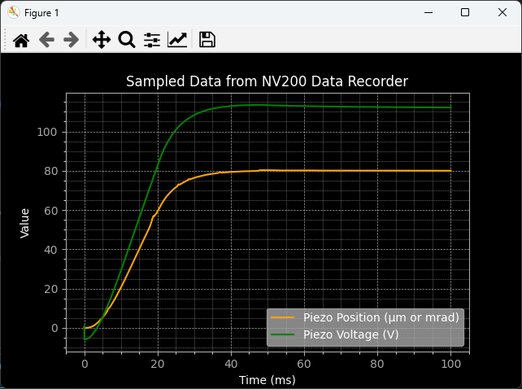

Data Recorder
----------------------------

If the device provides data recorder functionality, such as the NV200 amplifier
you can use the :class:`DataRecorder <nv200.data_recorder.DataRecorder>` class to access the data 
recorder functionality. For example, the NV200 data recorder consists of two memory banks that are 
written to in parallel. In this way, two individual signals can be stored synchronously.

**Example**: A step input via the set command is used to trigger the data recorder and measure the 
piezo position and current of amplifier 1 for 25 ms.

.. image:: images/data_recorder_example.png
   :align: center
   :alt: Data recorder example

The following example demonstrates how to use the :mod:`nv200.data_recorder` module with the 
`DeviceClient` from the `nv200.device_interface`. It covers setting up the `DataRecorder`, 
configuring data sources, and recording data.

.. code-block:: python

    import asyncio
    import matplotlib.pyplot as plt
    from nv200.device_interface import DeviceClient
    from nv200.data_recorder import DataRecorderSource, RecorderAutoStartMode, DataRecorder

    async def data_recorder_tests(device: DeviceClient):
        """
        Asynchronous function to test the functionality of the DataRecorder with a given device.
        """

        # Move the device to its initial position and wait for a short duration to stabilize
        await device.move_to_position(0)
        await asyncio.sleep(0.4)

        # Create a DataRecorder instance and configure it
        recorder = DataRecorder(device)
        await recorder.set_data_source(0, DataRecorderSource.PIEZO_POSITION)
        await recorder.set_data_source(1, DataRecorderSource.PIEZO_VOLTAGE)
        await recorder.set_autostart_mode(RecorderAutoStartMode.START_ON_SET_COMMAND)
        rec_param = await recorder.set_recording_duration_ms(100)
        print("Recording parameters:")
        print(f"  Used buffer entries: {rec_param.bufsize}")
        print(f"  Stride: {rec_param.stride}")
        print(f"  Sample frequency (Hz): {rec_param.sample_freq}")

        # Start recording and move the device to a new position to record the parameters
        await recorder.start_recording()
        await device.move_to_position(80)
        await asyncio.sleep(0.4)
        print("Reading recorded data of both channels...")

        # Read the recorded data from the DataRecorder
        rec_data = await recorder.read_recorded_data()

        # Use matplotlib to plot the recorded data
        prepare_plot_style()
        plt.plot(rec_data[0].sample_times_ms, rec_data[0].values, linestyle='-', color='orange', label=rec_data[0].source)
        plt.plot(rec_data[1].sample_times_ms, rec_data[1].values, linestyle='-', color='green', label=rec_data[1].source)   
        show_plot()

Step by step guide to using the Data Recorder
=============================================

This guide will walk you through the steps to set up and use the data recorder using the given
example code.
    

Step 1: Import Necessary Modules
^^^^^^^^^^^^^^^^^^^^^^^^^^^^^^^^^^^^^^^^^^^^^^^^^^^^^^^^^^^^^^^^

You will need to import the required modules to interact with the device and set 
up the data recorder. These include `DeviceClient` from `nv200.device_interface`, 
and `DataRecorder`, `DataRecorderSource`, and `RecorderAutoStartMode` from `nv200.data_recorder`.

.. code-block:: python

    import asyncio
    from nv200.device_interface import DeviceClient
    from nv200.data_recorder import DataRecorderSource, RecorderAutoStartMode, DataRecorder

Step 2: Setup the DeviceClient
^^^^^^^^^^^^^^^^^^^^^^^^^^^^^^^^^^^^^^^^^^^^^^^^^^^^^^^^^^^^^^^^

The `DeviceClient` instance is responsible for interacting with the hardware, allowing you 
to control the movement of the device and manage the data recorder.

.. code-block:: python

    async def data_recorder_tests(device: DeviceClient):
        await device.move_to_position(0)  # Move device to initial position (0)
        await asyncio.sleep(0.4)  # Allow the device to settle

Step 3: Create a DataRecorder Instance
^^^^^^^^^^^^^^^^^^^^^^^^^^^^^^^^^^^^^^^^^^^^^^^^^^^^^^^^^^^^^^

Once the device is ready, create an instance of the `DataRecorder` class, passing t
he `DeviceClient` instance to it. This will allow the DataRecorder to manage data recording.

.. code-block:: python
    
    recorder = DataRecorder(device)

Step 4: Set Data Sources for Recording
^^^^^^^^^^^^^^^^^^^^^^^^^^^^^^^^^^^^^^^^^^^^^^^^^^^^^^^^^^^^^^

Choose what data each of the two channels should record. Example:

.. code-block:: python

        await recorder.set_data_source(0, DataRecorderSource.PIEZO_POSITION)
        await recorder.set_data_source(1, DataRecorderSource.PIEZO_VOLTAGE)

Available options in `DataRecorderSource` include:

- `PIEZO_POSITION`: Piezo position (μm or mrad)
- `SETPOINT`: Setpoint (μm or mrad)
- `PIEZO_VOLTAGE`: Piezo voltage (V)
- `POSITION_ERROR``: Position error
- `ABS_POSITION_ERROR`: Absolute position error
- `PIEZO_CURRENT_1`: Piezo current 1 (A)
- `PIEZO_CURRENT_2`: Piezo current 2 (A)

Step 5: Set Auto-Start Mode
^^^^^^^^^^^^^^^^^^^^^^^^^^^^^^^^^^^^^^^^^^^^^^^^^^^^^^^^^^^^^^

The `set_autostart_mode` function defines when the recording will start. 
In this example, the recording starts when the set command is issued.

.. code-block:: python

        await recorder.set_autostart_mode(RecorderAutoStartMode.START_ON_SET_COMMAND)

You can choose different start modes:

- `OFF`: No auto-start - recording starts immediately when `start_recording` is called
- `START_ON_SET_COMMAND`: Starts when a set command is issued after the `start_recording` call
- `START_ON_WAVEFORM_GEN_RUN`: Starts recording when the waveform generator is started after the `start_recording` call

Step 6: Configure Recording Duration
^^^^^^^^^^^^^^^^^^^^^^^^^^^^^^^^^^^^^^^^^^^^^^^^^^^^^^^^^^^^^^

Next, you can set the recording duration. The `set_recording_duration_ms` method calculates 
the necessary buffer size and sample rate based on the specified duration. You can print
the returned parameters to see that calculated values that have been transferred to the device.

.. code-block:: python
    
    rec_param = await recorder.set_recording_duration_ms(100)
    print("Recording parameters:")
    print(f"  Used buffer entries: {rec_param.bufsize}")
    print(f"  Stride: {rec_param.stride}")
    print(f"  Sample frequency (Hz): {rec_param.sample_freq}")

This is the expected output for this example:

.. code-block:: text

    Recording parameters:
      Used buffer entries: 1000
      Stride: 1
      Sample frequency (Hz): 10.0

Step 7: Start Recording
^^^^^^^^^^^^^^^^^^^^^^^^^^^^^^^^^^^^^^^^^^^^^^^^^^^^^^^^^^^^^^

Once everything is set up, you can start the recording by calling:

.. code-block:: python

    await recorder.start_recording()  # Starts the data recording

This will not start the recording immediately, but it will prepare 
the device to start recording when the specified trigger condition is met 
(in this case, when the set command is issued).

Step 8: Execute Device Move and Record Data
^^^^^^^^^^^^^^^^^^^^^^^^^^^^^^^^^^^^^^^^^^^^^^^^^^^^^^^^^^^^

Now you can trigger the actual recording start by moving the device to a new position.
in this example, the `move_to_position` method triggers the data recorder to start recording.

.. code-block:: python

    await device.move_to_position(80)  # Move the device to position 80
    await asyncio.sleep(0.4)  # Wait while the data is being recorded

Once the device has moved, you can read the recorded data:

.. code-block:: python

    recorded_data = await recorder.read_recorded_data()  # Read the data from both channels

This will return a list containing data from channel 0 and channel 1. Each channel's data is 
stored as a `ChannelRecordingData` object, which includes:

- sample_times_ms: 
      The time at which each sample was taken (in milliseconds).
- values: 
      The recorded data values.
- source: 
      The data source that was recorded (e.g., "Piezo Voltage").

Step 9: Plot the Recorded Data (Optional)
^^^^^^^^^^^^^^^^^^^^^^^^^^^^^^^^^^^^^^^^^^^^^^^^^^^^^^^^^^^^

After retrieving the recorded data, you can plot it using a library like `matplotlib <https://matplotlib.org/>`_:

.. code-block:: python

    prepare_plot_style()
    plt.plot(rec_data[0].sample_times_ms, rec_data[0].values, linestyle='-', color='orange', label=rec_data[0].source)
    plt.plot(rec_data[1].sample_times_ms, rec_data[1].values, linestyle='-', color='green', label=rec_data[1].source)   
    show_plot()

The expected output is a plot showing the recorded data from both channels:

.. admonition:: Important
   :class: note

   Important Considerations
   
   - Device Connection: 
         Ensure the device is properly connected and configured before starting recording.
   - Buffer Size Limitations: 
         The NV200 device has a fixed buffer size, so be mindful of memory constraints. Use the max_sample_buffer_size property to check the buffer size limit.
   - Auto-Start Behavior: 
         Depending on the chosen auto-start mode, recordings might begin automatically or require explicit start commands.

API Reference
==============
.. automodule:: nv200.data_recorder
   :members:
   :show-inheritance:
   :undoc-members: