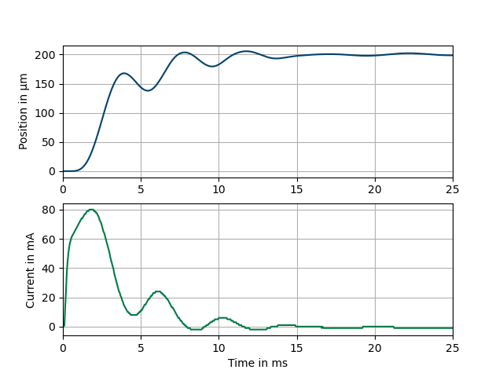

Using the Data Recorder
----------------------------

If the device provides data recorder functionality, such as the NV200 amplifier
you can use the :class:`DataRecorder <nv200.data_recorder.DataRecorder>` class to access the data 
recorder functionality. For example, the NV200 data recorder consists of two memory banks that are 
written to in parallel. In this way, two individual signals can be stored synchronously.

**Example**: A step input via the set command is used to trigger the data recorder and measure the 
piezo position and current of amplifier 1 for 25 ms.

The following example shows how to use the data recorder functionality of the NV200 amplifier:

.. code-block:: python

    import asyncio
    from nv200.device_interface import DeviceClient
    from nv200.data_recorder import DataRecorderSource, RecorderAutoStartMode, DataRecorder

    async def data_recorder_tests(device: DeviceClient):
        await device.move_to_position(0)
        await asyncio.sleep(0.4)

        recorder = DataRecorder(device)
        await recorder.set_data_source(0, DataRecorderSource.PIEZO_POSITION)
        await recorder.set_data_source(1, DataRecorderSource.PIEZO_VOLTAGE)
        await recorder.set_autostart_mode(RecorderAutoStartMode.START_ON_SET_COMMAND)
        rec_param = await recorder.set_recording_duration_ms(100)

        await recorder.start_recording()
        await device.move_to_position(80)
        await asyncio.sleep(0.4)
        print("Reading recorded data of both channels...")
        rec_data = await recorder.read_recorded_data()
        # Plot recorded data using matplotlib
        plot_recorded_data(rec_data, rec_param.sample_freq)
    