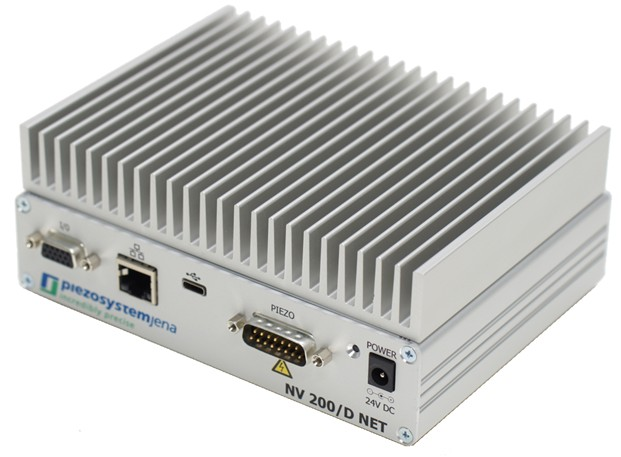

NV200 Python Library
==================================

The NV200 Python library provides a Python interface to control the 
`NV200/D Compact Amplifier <https://www.piezosystem.com/product/nv-200-d-compact-amplifier/>`_  from 
`piezosystem Jena <https://www.piezosystem.com>`_. It supports communication with the device via 
both Ethernet and USB interfaces.

.. toctree::
   :maxdepth: 2
   :caption: Contents:

   intro.rst
   installation.rst
   connecting.rst
   getting_started.rst
   data_recorder.rst
   waveform_generator.rst
   api.rst

Indices and tables
--------------------
* :ref:`genindex`
* :ref:`modindex`
