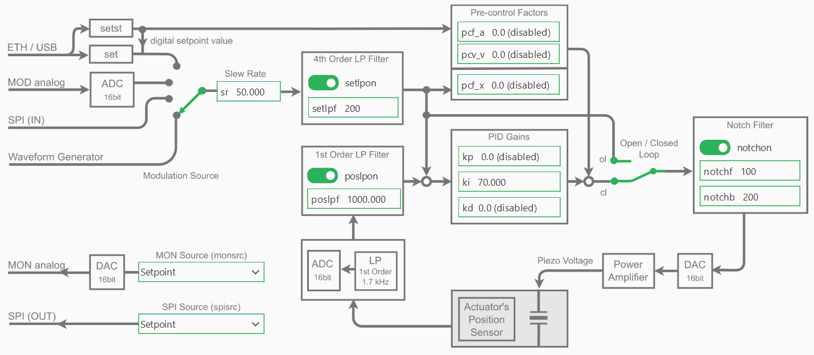

PID Controller and Filters
===========================

Overview & Block Diagram
----------------------------

The NV200 device supports PID control and various filters to manage the movement of the device.
The following image shows the block diagram of the device with the PID and filter parts highlighted:

PID Controller Parameters
---------------------------

PID Control Mode
^^^^^^^^^^^^^^^^^^^^^^

The PID-controller can work in two different modes: The open loop mode (OL) and the closed loop mode (CL).
To change the parameters of the PID controller, you can simply access the `NV200Device.pid` attribute
of type `NV200Device.PIDController`.

The following example shows how to switch the PID control mode between open loop and closed loop:

.. code-block:: python

    device = await connect_to_single_device(NV200Device, TransportType.SERIAL)

    # Toggle the PID control mode between open loop and closed loop
    pid = device.pid
    await pid.set_mode(PidLoopMode.OPEN_LOOP)
    await pid.set_mode(PidLoopMode.CLOSED_LOOP)
    await pid.set_closed_loop(True)
    await pid.set_closed_loop(False)

In open loop mode the PID-controller is bridged and the command input directly controls the amplifier, 
which can provide a voltage between -20 V and +180 V, however, limited to the admissible voltage range 
of the connected piezo actuator. The resulting piezo stroke then depends on the characteristic of the 
piezo actuator and is affected by piezo-typical creeping and hysteresis behavior. If you would like
to position the piezo actuator in open loop mode, you can use the `move_to_voltage` function.
This function switches the PID controller to open loop mode and sends the desired voltage command.

.. code-block:: python

   await device.move_to_voltage(100.0)  # Move to 100 V in open loop mode

In closed loop mode (CL), these effects will be compensated by the digital loop controller. 
The position sensor value can also be filtered with an adjustable 1st order low pass filter in 
order to reduce the measurement noise spectrum. To position the piezo actuator in closed loop mode,
you can use the `move_to_position` function. This function switches the PID controller to closed loop mode
and sends the desired position command.

.. code-block:: python

   await device.move_to_position(80.0)  # Move to 10 µm in closed loop mode

PID Gains
^^^^^^^^^^^^^^^^^^^^^^

The controller-specific parameters are stored in the actuator's ID-chip. The default parameters were 
determined in the piezosystem jena laboratory and ensure safe function of the actuator and will work 
for most applications. Depending on your application, additional load, setpoint trajectory and motion 
requirements, fine tuning of the control parameters will most likely improve your results.

.. warning::

   Always **export and save** the actuator configuration **before** writing or experimenting with actuator 
   parameters (see `Actuator Configuration Backup`).

After accessing the PID controller via the device interface, you can modify the PID gains as follows:

.. code-block:: python

    device = await connect_to_single_device(NV200Device, TransportType.SERIAL)

    # Access the pid object via the device interface
    pid = device.pid

    # set single PID gains
    await pid.set_pid_gains(ki=70)
    await pid.set_pid_gains(kp=0.1)

    # set all PID gains at once
    await pid.set_pid_gains(kp=0.0, ki=70, kd=0.0)

    # Read back the PID gains
    print(f"PID gains: {await pid.get_pid_gains()}")

To adapt the controller properties to your special application please start with the default values. In general, 
change the parameters in small steps and, depending on the actuator's reaction, slightly increase the step size.
If the system begins to oscillate, switch to open loop mode immediately, then reset to stable values again.

Slew Rate
---------------------------

For filtering the set point, a slew rate limiter is implemented, which can be changed via the `set_slew_rate` function. 
The slew rate is defined in %/ms. 

.. code-block:: python

   device.set_slew_rate(10)  # Set slew rate to 10 %/ms
   print(f"Slew rate: {await device.get_slew_rate()} %/ms")

For example, a value of 1 %/ms yields that a jump off the full motion 
range (100 %) is converted into a ramp with 100 ms duration. Independent from the slew rate value set in 
the controller, the limitation given by the high voltage amplifier cannot be exceeded, since the piezo 
voltage slew rate is limited by the amplifiers maximum output current and the actuators capacity.

Filters
---------------------------

As shown in the control block diagram, the NV200 device includes several configurable filters to improve system stability and performance:

- A **1st-order low-pass filter** on the **position sensor input**
- A **4th-order low-pass filter** on the **setpoint input**
- A **notch filter** applied to the **control output**

These filters can be accessed and configured individually through the device interface.

Setpoint Low-Pass Filter
^^^^^^^^^^^^^^^^^^^^^^^^^^^^^^^^^^^^^^^^^^^^

The setpoint low-pass filter (`setpoint_lpf`) smooths the commanded input signal to avoid abrupt changes and reduce noise:

.. code-block:: python

    slpf = device.setpoint_lpf
    await slpf.set_cutoff(200)    # Set cutoff frequency to 200 Hz
    await slpf.enable(False)      # Disable the setpoint low-pass filter
    print(f"Setpoint LPF Cutoff Frequency: {await slpf.get_cutoff()} Hz")

Position Low-Pass Filter
^^^^^^^^^^^^^^^^^^^^^^^^^^^^^^^^^^^^^^^^^^^^

The position low-pass filter (`position_lpf`) filters noise from the position sensor before it enters the control loop:

.. code-block:: python

    plpf = device.position_lpf
    await plpf.set_cutoff(1000)   # Set cutoff frequency to 1000 Hz
    await plpf.enable(True)       # Enable the position low-pass filter
    print(f"Position LPF Cutoff Frequency: {await plpf.get_cutoff()} Hz")

Notch Filter
^^^^^^^^^^^^^^^^^^^^^^^^^^^^^^^^^^^^^^^^^^^^

The notch filter (`notch_filter`) is used to suppress specific resonant frequencies in the system, often caused by 
mechanical resonances. It is defined by its center frequency and bandwidth:

.. code-block:: python

    nf = device.notch_filter
    await nf.set_bandwidth(200)   # Set notch filter bandwidth to 200 Hz
    await nf.set_frequency(100)   # Set notch filter center frequency to 100 Hz

.. note::

   Filters can be enabled or disabled independently and should be tuned according to the dynamics and noise characteristics of your system.